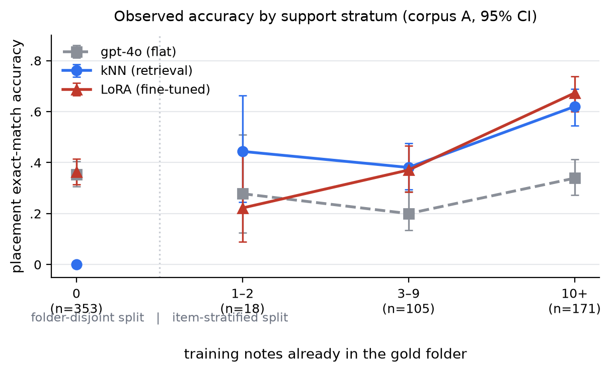

# The Occupancy Curve: A Support-Stratified Evaluation of LLM Note Placement

**Draft — 2026-08-19. Not anonymized. 4-page short-paper target.**

## Abstract

When an LLM agent files a new note into an existing folder hierarchy, prior
work does not report accuracy as a function of how many notes already sit
in the target folder (its *support*) — nor does it evaluate folders with no
prior notes at all. We stratify by support directly and find that method
rankings differ by stratum: a frontier model prompted with the full folder
tree stays in a narrow band, a retrieval baseline is consistently above it,
and a fine-tuned small model crosses both. We validate our gold labels with
a two-annotator study (Cohen's κ=0.901). On a second corpus we also
stratify by support directly, and on a third; in the item-stratified
regime shared by all three, a fine-tuned model beats the retrieval-then-pick
cascade that wins on our first corpus — a reversal reproduced on both
additional corpora, whose cause we tested for (a proposed tree-size
mechanism) and did not find. We report the reversal as real and its cause
as open, rather than force an explanation onto it. Support strata are
confounded with folder, vault, and corpus identity — we do not claim
support causes the ranking change, only that it correlates with it and the
correlation reproduces where we have the data to check.

## 1. Introduction

Write-time filing — given a new note and an existing folder tree, which
folder should it join — is a small, concrete instance of the broader
agent-memory-organization problem. It has a clean metric (does the model's
predicted path match where the note was actually filed) and a natural
axis the literature has not stratified results by: how much evidence
already exists for the target folder. A folder with fifteen similar notes
in it is evaluated identically to a folder with zero in existing work,
even though nothing guarantees a method that's good at one is good at
the other.

PaperRouter-Agent (Zhou et al., arXiv 2607.11564) names this task PHPR and
reports a cascade of retrieval and LLM inspection beating a flat baseline
by 22 points on five researchers' Zotero libraries. Their pipeline already
formalizes folders by their existing members and abstains when membership
is too thin, but does not report accuracy *as a function of* member count
and does not evaluate folders with zero members. We do not know, and do
not claim to know, whether their support distribution skews toward
well-populated folders — only that they do not report the stratified
breakdown, and we do.

We stratify by support directly. Figure 1 shows the result on our primary
corpus: a frontier model given the full folder list (**flat**) stays in a
narrow band across the item-stratified support strata; a
**k-nearest-neighbor** retrieval baseline sits consistently above it at
every positive-support stratum; a **fine-tuned 8B model** crosses both.
The disconnected zero-support point (a separately constructed evaluation,
see §3) is not comparable to the item-stratified strata as a "band width" —
it comes from a different split with different method configurations
entirely (§3) — but it is itself informative: all three methods are much
closer to each other there than anywhere else on the item-stratified side,
a fourth regime prior work has not reported on at all, not just an
underreported tail of the one it does.

**Contributions.**
1. A support-stratified evaluation for note placement, including a
   zero-support (folder-disjoint) regime existing work does not evaluate.
2. A candidate-set-size × grounding factorial (§4.2) that is suggestive,
   not decisive, about which part of PaperRouter-Agent's reported gain a
   retrieval step alone could plausibly account for.
3. Cross-corpus evidence (two independent public corpora, 43 vaults/repos
   total, item-stratified split) that a fine-tuned model beats a
   retrieval-then-pick cascade in a regime where our own private corpus
   shows the opposite ranking — a real, reproduced reversal whose cause we
   test for and do not find (§4.3). One of the two public corpora also has
   a folder-disjoint result, and it does *not* show this reversal (§4.3,
   §6) — the reversal is specific to the seen-folder regime, on the
   evidence we have.
4. A two-annotator gold-label validation study, κ=0.901, on whether our
   corpus-A gold labels are sensible destinations — not a validation of
   the exact-match metric's single-correct-answer assumption, which the
   study does not test (§5).



*Figure 1. Corpus A. The x=0 point comes from a separately constructed
folder-disjoint split with different method configurations (§3) and is
plotted disconnected from the item-stratified strata (x=1..3) — it is not
the left edge of one fitted curve, and its spread should not be compared
to theirs as if it were. 95% Wilson-score confidence intervals shown per
point (marginal per-point intervals, not a test of the between-point
difference); n=18 at the 1–2 stratum is the point to read most cautiously.
gpt-4o given the full folder list stays in a narrow band across the
item-stratified strata; kNN sits above it at every one of those strata;
LoRA crosses both flat and kNN. The kNN/LoRA 1–2-vs-3–9 gap is small
relative to their wide, overlapping intervals at n=18 — read as
inconclusive at that stratum, not as evidence either way.*

## 2. Related Work

**PaperRouter-Agent (arXiv 2607.11564).** Same task (they call it PHPR),
flat 0.39 → agent 0.61 on five Zotero libraries. No unseen-folder evaluation,
no retrieval-only baseline, no fine-tuned baseline, and no support-stratified
breakdown — our contribution is the missing axis, not a new task.

**Filesystem-as-Memory (arXiv 2607.26637).** Finds that organizing agent
memory as a folder tree does not itself improve downstream answer accuracy;
organization pays for itself in retrieval cost, not correctness. We do not
claim placement quality improves answers — our metric is purely "did the
file land where it actually sat," not any downstream task.

**MemDelta (arXiv 2606.29914).** A one-variable-at-a-time protocol paper
showing a single unreported hidden variable can flip a memory-system's
reported conclusions. Its methodological caution is why we run more than
one model family (gpt-4o and Llama-3.3-70B) and report every protocol axis
(prompt token counts, candidate-set sizes, split construction) rather than
a single number.

**Zero-shot extreme multi-label classification** (ZestXML, SemSup-XC, and
related work) routinely evaluates unseen-label splits. The folder-disjoint
split we use is not a novel method — it is standard practice one field over
that this literature has not adopted.

## 3. Task and Method

**Task.** Given a note's text and a folder tree, predict the folder path
the note belongs in. We score exact path match against the note's actual
folder-of-record.

**Support.** For a given train/val split, a val item's *support* is the
number of training-partition notes already filed in its gold folder. We
bucket into {0, 1–2, 3–9, 10+}. **These buckets are not one continuous
curve — they come from two separately constructed splits of the same
underlying task pool**, and the methods evaluated on each are configured
differently, described below. Zero support comes from a folder-disjoint
split (entire folders held out of training, guaranteeing zero support by
construction, verified on every corpus). Positive support comes from a
separate item-stratified split (folders seen in training, individual notes
held out). We report both in one table for space, but treat the zero-
support point as a distinct experiment, not the left edge of a fitted
curve — a limitation we return to in §6, and a reason Figure 1 does not
connect it to the rest of the line.

**Methods compared, item-stratified split (support > 0).** (1) **Flat**:
full folder list in the prompt, gpt-4o. (2) **kNN**: embed the new note,
retrieve its nearest neighbors among training notes, predict their folder
(majority vote; k=5). Zero by construction on the 0-support bucket — it can
only predict folders that have a training example. (3) **Cascade**:
embedding shortlist of the top-20 folders by nearest-training-note
similarity, then an LLM pick from the shortlist — same prompt/parser as
flat, only the candidate list changes. (4) **LoRA**: llama-3.1-8b, LoRA
rank 16, 1 epoch, fine-tuned on the item-stratified train split, full
folder list at inference (matches flat's information, not cascade's).

**Methods compared, folder-disjoint split (support = 0), corpus A only.**
Because no training note exists in an unseen folder, kNN's note-based
shortlist is empty by construction and the cascade instead uses a
folder-*path-string* embedding shortlist (top-50, not top-20 — chosen
because it has substantially higher recall against unseen folders on this
corpus, see PLACER_FINDINGS.md), and LoRA is a **separately fine-tuned
model** trained on the folder-disjoint split's own train partition, not the
same checkpoint used for the positive-support buckets. The zero-support row
in every table in this paper is therefore not "the same four methods
extrapolated to zero" — it is a different cascade configuration and a
different LoRA checkpoint, evaluated on a genuinely different task
(generalizing to a folder with no exemplar at all).

**Corpora.** Corpus A: one person's private working directory, 870 tasks
across 170 folders that actually hold a task (the model is offered the
larger set of 365 candidate folders that exist in the tree, most of them
empty of training/val tasks), 78% one software project (`work/openclaw`)
— see §6 for the construct-validity implication. Corpus B: 27 public
personal markdown note vaults (GitHub; 14/27 use Obsidian specifically, the
rest are plain markdown note collections), 4,199 tasks, mean 39 folders/
vault, selected and filtered by a two-stage classifier (structural
thresholds alone cannot separate personal note vaults from software
repositories that happen to ship markdown — package-manifest and
source-file-count signals can; see Appendix A). Corpus B also has a
folder-disjoint evaluation, reported in §4.3 alongside its item-stratified
result — item-stratified is still where this paper's headline results
live. Corpus A′: 16 public software repositories, 2,644 tasks, mean 63
folders/repo. A′'s folder-disjoint split data was built but never
evaluated (no method was run on it) — an explicit scope choice, not a
null result; A′ contributes item-stratified results only in this paper.
All corpora pin commit SHAs; note text is never redistributed, aggregate
statistics only.

## 4. Results

### 4.1 Accuracy by support stratum (corpus A)

| support | n | flat (gpt-4o) | kNN | LoRA |
|---|---|---|---|---|
| 0 | 353 | 0.354 | 0.000 | 0.363 |
| 1–2 | 18 | 0.278 | 0.444 | 0.222 |
| 3–9 | 105 | 0.200 | 0.381 | 0.371 |
| 10+ | 171 | 0.339 | 0.620 | 0.673 |

Within the item-stratified split (1–2/3–9/10+), flat stays in a narrow
band (.20–.34); kNN sits above flat at every one of these three strata
(never crosses it); LoRA crosses both flat and kNN, below flat at 1–2 and
above both flat and kNN by 10+. The 1–2 vs. 3–9 movement for kNN and LoRA
is not distinguishable from noise given their wide, overlapping intervals
at n=18 (Figure 1) — read the exact ordering within that pair as
inconclusive. A fourth method, the retrieval-then-pick cascade (embedding
shortlist → gpt-4o), was not broken down by support stratum, but wins on
both splits taken as wholes: 0.643 vs. 0.537 (LoRA) pooled across the
item-stratified split (n=294, p=0.00045, paired), and 0.419 vs. 0.363 on
the separately constructed zero-support split (n=353, p=0.040, paired) —
no training required to beat the fine-tuned model on either. These
p-values, and every p-value in this paper computed on corpus A, come from
a single tree (corpus A has one folder hierarchy), so they describe this
corpus's items, not a population of trees; we do not treat them as
evidence the result generalizes — §4.3 tests that directly and finds it
does not, in this ranking's specific direction.

### 4.2 Candidate-set size × grounding factorial

A 2×2 factorial, corpus A, item split (n=294, paired, single tree — same
single-tree caveat as §4.1). The two factors are candidate-set size
(365 folders vs. a retrieved top-20) and grounding (whether each candidate
folder carries a one-line description). We call it a factorial because
both factors are crossed in the design below, not because either factor
is internally decomposed — cutting the candidate list to a retrieved
top-20 is one bundled intervention (it changes what's retrieved, the
candidate count, and prompt length together), not an isolation of
retrieval as a mechanism.

| | no descriptions | + descriptions |
|---|---|---|
| flat (365 folders) | 0.286 | 0.306 (p=0.489, ns) |
| retrieved top-20 | 0.643 | 0.660 (p=0.487, ns) |

Moving from the flat row to the retrieved-top-20 row is associated with
+35pt in both columns; adding a one-line folder description within either
row is within noise — failure to reject at n=294, not evidence the two
conditions are equivalent. This is suggestive about PaperRouter-Agent's
reported +22pt gain, not decisive: our grounding condition is a one-line
summary from at most four truncated notes, not their full top-down
planning and type-aware member inspection, and our candidate-set-size
factor is a bundled intervention as noted above — we cannot separate a
pure retrieval effect from a pure list-shortening effect here, so we do
not claim to have identified which of their pipeline stages drives their
number.

### 4.3 Cross-corpus generalization, item-stratified split only

The same cascade-vs-LoRA comparison on two independent public corpora,
**item-stratified split** (the regime §4.1 covers; see below for what
corpus B's folder-disjoint split shows):

| corpus | LoRA | cascade | vault-level win count |
|---|---|---|---|
| A (private, 1 tree) | 0.537 | **0.643** | n/a — one tree |
| B (27 personal vaults) | **0.756** | 0.592 | LoRA 19/27, cascade 6, tie 2 |
| A′ (16 software repos) | **0.716** | 0.552 | LoRA 13/16, cascade 3/16, tie 0 |

Cascade wins on A; LoRA wins on both B and A′ on this split, and the win
is broad at the vault level on both — not a pooled-average artifact of a
few vaults. Corpus B's own support-stratified breakdown (analogous to
Table in §4.1, kNN at $k=5$, cascade path@20) replicates the crossing
pattern, not just the aggregate:

| support | n | flat (gpt-4o) | kNN | cascade | LoRA |
|---|---|---|---|---|---|
| 1–2 | 258 | 0.547 | 0.457 | 0.628 | 0.667 |
| 3–9 | 653 | 0.662 | 0.718 | 0.729 | 0.776 |
| 10+ | 558 | 0.332 | **0.833** | 0.414 | 0.772 |

LoRA leads at 1–2 and 3–9; kNN overtakes everything, including LoRA, at
10+ — cascade never leads any stratum on corpus B, unlike on corpus A
where it wins pooled. This is genuine stratum-level replication of "the
ranking is not what corpus A showed," not merely the same aggregate
number restated. **This does not hold on the folder-disjoint split.**
Corpus B's zero-support evaluation shows cascade beating LoRA there too
(0.583 vs. 0.475) — the same ranking as corpus A, not the reversal.
(A′'s folder-disjoint split data exists but was never evaluated with any
method — an explicit scope choice, not a null result; see §6.) The
reversal reported here is specific to the item-stratified, seen-folder
regime and should not be read as "LoRA wins on public corpora" without
that qualifier. A′ has no support-stratified breakdown of its own in this
paper (item-split aggregate only, by design, §3) — for A′ we can say the
aggregate item-split reversal replicates; only corpus B lets us also say
the stratum-level crossing pattern replicates.

We hypothesized tree size as the mechanism for the item-stratified
reversal (smaller trees favor a model that sees the whole folder list;
larger trees favor a shortlist-based cascade) and tested it directly: a
permutation test on the correlation between each vault's folder count and
its (LoRA − cascade) margin, at the vault level — the correct unit, since
items within a vault are not independent draws.

```
corpus B    n=27  spearman(log-folders, margin) = +0.029   p=0.887
corpus A′   n=16  spearman(log-folders, margin) = -0.115   p=0.669
pooled      n=43  spearman(log-folders, margin) = +0.034   p=0.826
```

Null in both corpora, opposite-signed between them. **We found no
evidence that tree size explains the margin** — a null result at n=27/16,
not proof the effect is zero. An earlier version of this analysis, pooling
items across vaults into three folder-count bins, showed a strong,
monotone, "significant" pattern (p as low as 10⁻²⁵) — an artifact of
treating correlated items as independent draws, caught before this
pattern was reported as a finding. We report the item-stratified reversal
as real (broad, vault-level, reproduced on two corpora) and its cause as
genuinely open. Candidate explanations we have not ruled out, and consider
at least as likely as tree size: the two public corpora pool training data
across many vaults into one fine-tuned model, so the win could reflect
total training volume or cross-tree transfer rather than anything about
individual trees (§6); candidate-set size also covaries with tree size and
directly affects §4.2's comparison too, since LoRA effectively sees the
whole tree while the cascade sees a top-20 shortlist.

## 5. Gold-Label Validation

Exact-match accuracy assumes the recorded folder-of-record is a sensible
destination for a note. We tested *that* — not whether it is the single
uniquely correct destination, which "ambiguous" below explicitly does not
assume. 100 items sampled from corpus A, stratified to match §4.1's support
strata (35 zero-support / 18 sparse / 25 mid / 22 dense), judged
independently by two annotators against one question — given only the note
text, is the recorded folder a sensible home for it?

| | correct | ambiguous | unclear | wrong |
|---|---|---|---|---|
| annotator 1 | 80/98 | 12/98 | 6/98 | 0/98 |
| annotator 2 | 82/100 | 10/100 | 8/100 | 0/100 |

Cohen's κ = 0.901 on the 98 items both judged (exact-verdict agreement
95/98; annotator 1's total is 98 rather than 100 because 2 of the original
100 sampled items turned out to be the same physical note drawn from both
splits' validation pools, collapsing to one judgment — fixed for annotator
2's pass). Zero cases where one annotator called a label correct and the
other called it wrong — every disagreement is a boundary call between
"correct" and "ambiguous," or "ambiguous" and "unclear." 80/98 (82%) to
92/98 (94%) of sampled gold labels are confirmed sensible, depending on
whether "ambiguous" (a note that plausibly fits more than one folder)
counts against the label. This is a statement about the gold labels
themselves, not about exact-match's error rate on any method's
predictions — the study never showed annotators a model's output, so it
cannot bound how often exact-match scores a defensible prediction as
wrong. Disagreement concentrates in
the sparse-support stratum (56% clean agreement vs. 91%/76%/91%
elsewhere). In §4.1, LoRA is also worst at the sparse stratum, but flat
and kNN are both worst at 3–9, not 1–2 — so this is not "every method does
worst in the same place the labels are noisiest," only LoRA's shape lines
up with the annotation-disagreement pattern, and we do not read more into
that single alignment than it can support. This study covers corpus A
only; corpora B and A′ were not annotated (avoiding external-annotator
exposure to other people's public-vault text), so this result does not
extend to them.

## 6. Discussion and Limitations

**What this paper supports.** Placement accuracy correlates with
target-folder support, and different methods dominate different support
strata — an association, observed and reproduced, not a causal claim (see
the confound check immediately below, which is why we phrase it as
correlates-with rather than depends-on throughout). The item-stratified
cascade-vs-LoRA reversal is real and reproduced on two independent public
corpora, including at the stratum level on corpus B, not just in
aggregate; corpus B's folder-disjoint split does not show it (§4.3) — the
reversal is specific to one regime, not a general law about fine-tuning
vs. retrieval.

**What this paper does not support.** That support *causes* the ranking
change (the split construction confounds support with folder identity,
vault identity, and difficulty — see the confound check below); that tree
size explains the item-stratified corpus-B/A′ reversal (tested directly,
null); that placement quality improves any downstream task (out of scope,
per Filesystem-as-Memory); or that "the field evaluates only the
high-support end" (PaperRouter-Agent's own support distribution is simply
unreported, not shown to be high — we claim only that they do not report
the stratified breakdown).

**Confound check.** Corpus B's flat gpt-4o arm — which cannot use
training-folder support at all — still swings 0.547→0.662→0.332 across the
same three support strata. The strata encode more than support alone
(folder/vault difficulty, label distribution); the LoRA/kNN variation
across strata should not be read as caused by support in isolation.

**Corpus construction.** Corpus A is 78% one software project. Corpus A′
lost 9 of 25 selected repositories to clone timeouts; corpus B capped 9 of
27 vaults at 250 notes, taken in filesystem-traversal order (`Path.rglob`)
rather than randomly. Any of these could shift measured support or tree
size as a side effect of which files happened to survive, independent of
the underlying phenomenon. The classifier separating personal vaults from
software repositories in corpus B's selection (package-manifest and
source-file-count signals; see Appendix A) has no reported
precision/recall against a held-out labeled set — it was checked by hand
against known cases, not validated at scale.

**Cross-vault data quality.** Checked for exact and near-duplicate notes
leaking across vaults in the pooled B/A′ training data (embedding cosine
similarity, no new spend): 1 exact-text duplicate spanning two repos (both
in train, no train↔validation exposure), and 7/2,266 validation items
(0.31%) with a cross-vault near-duplicate above cosine 0.95, all one pair
of vaults sharing an Obsidian plugin's auto-generated placeholder file, not
user-authored content. Bounded and non-systemic, but disclosed because
pooled cross-vault training is central to §4.3's headline.

**Pooled training.** Corpora B and A′ each fine-tune one LoRA pooled across
all their vaults/repositories (per-item folder context stays local at
inference; model weights are shared). The B/A′ win over cascade may reflect
total training volume or cross-tree representation transfer rather than
anything about individual tree size specifically. We flag this rather than
resolve it — the controlled test (per-vault isolated training, or
leave-one-vault-out) is expensive and left to future work.

**No held-out confirmation split.** Every number in this paper, across all
three corpora, comes from a validation set that also implicitly shaped
which shortlist size, k, or analysis got reported. Results here should be
read as exploratory.

**Statistical unit.** Item-pooled significance tests in this domain are
pseudo-replicated — items within a vault or folder are correlated, not
independent. Corpus A is a single tree, so no vault-level replication is
possible there at all; its p-values describe that one corpus's items, not
a population of trees. Corpora B and A′ have vault-level counts reported
alongside item-pooled p-values in §4.3, and we recommend the vault count as
the trustworthy summary where both are available.

**Reproducibility.** Embeddings: `text-embedding-3-small`. kNN: k=5
(selected on the same validation data it is evaluated on, not
independently tuned — see "no held-out confirmation split" above). Split
construction and seeds: `scripts/build_user_dir_split.py` (corpus A,
default seed 7), `scripts/build_vault_corpus.py` (B, A′, per-vault
`build_user_dir_split.py` calls, same default seed); depth caps 5 (A) vs.
8 (B, A′), not matched across corpora. LoRA: llama-3.1-8b, rank 16, 1
epoch, lr 1e-4, single training run per corpus/split (no seed sweep).
Corpus B and A′ manifests pin commit SHAs per vault/repo; this
repository's own commit will be pinned at submission time (not yet done
in this draft). Full run logs, scripts, and per-item results:
`PLACER_FINDINGS.md` and the `phase0/` repository.

## 7. Conclusion

Note-placement method rankings vary by how much target-folder support
exists, an axis prior work in this task does not report results
stratified by, and this correlation is not fully explained by our own
negative-control check either — the strata carry more than support alone.
That finding survives adversarial review and a two-annotator gold-label
check on our primary corpus. A second, more striking-looking result — an
item-stratified cascade-vs-fine-tuning reversal reproduced on two
independent public corpora, but absent from corpus B's folder-disjoint
result, the one place we can check — is real but regime-specific, and a
proposed tree-size mechanism for it did not survive a statistically
correct test.
We report it as an open, unexplained, regime-bound reversal rather than
force a mechanism onto data that does not support one.

## Acknowledgments

Thanks to Rocky for an independent annotation pass on the gold-label
validation study (§5).

## References

- Zhou, K., Wang, L., Yuan, S., Lu, Z., Luo, Y., Wang, Z. PaperRouter-Agent:
  A Content-Grounded LLM Agent for Personalized Hierarchical Paper Routing.
  arXiv:2607.11564.
- Zhou, S., Yu, S., Wei, H., Wu, J., Ouyang, S., Jiao, Y., Pan, S.,
  McAuley, J., Zhang, Y., Yu, T., Han, J. Filesystem-Based Memory for LLM
  Agents: Organization, Evolution, and Sustainability. arXiv:2607.26637.
- Wang, K. MemDelta: Controlled Baselines and Hidden Confounds in Agent
  Memory Evaluation. arXiv:2606.29914.
- ZestXML / SemSup-XC (zero-shot extreme multi-label classification).

## Appendix A: Separating personal note vaults from software repositories

Corpus B's selection pool starts from public GitHub repositories matching
structural note-vault heuristics (note count, directory count, depth,
folder-size spread). Of 132 repositories passing those checks, 95 (72%)
turned out on manual inspection to be software projects that happen to
ship markdown documentation (e.g. an Obsidian *plugin's* own repository,
not a vault) — structural thresholds alone do not separate the two
populations. Markdown-to-total-file ratio also fails: a real vault in our
sample scored 0.41 on this ratio, a real software repository scored 0.51,
because vaults carry image/PDF attachments that dilute their own ratio.
What separates them reliably: presence of a package manifest
(`package.json`, `pyproject.toml`, `Cargo.toml`, etc.) or a source-file
count above 30 (`scripts/classify_vaults.py`). This two-stage filter was
checked by hand against known cases (vaults and repos we could identify by
name) during construction, not validated against an independently labeled
held-out set — a precision/recall estimate against such a set is future
work, not reported here.
